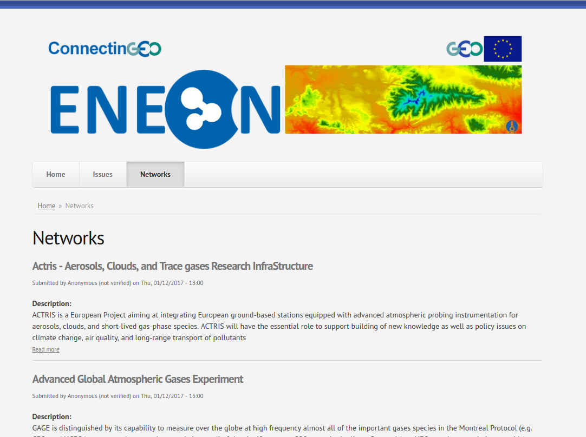
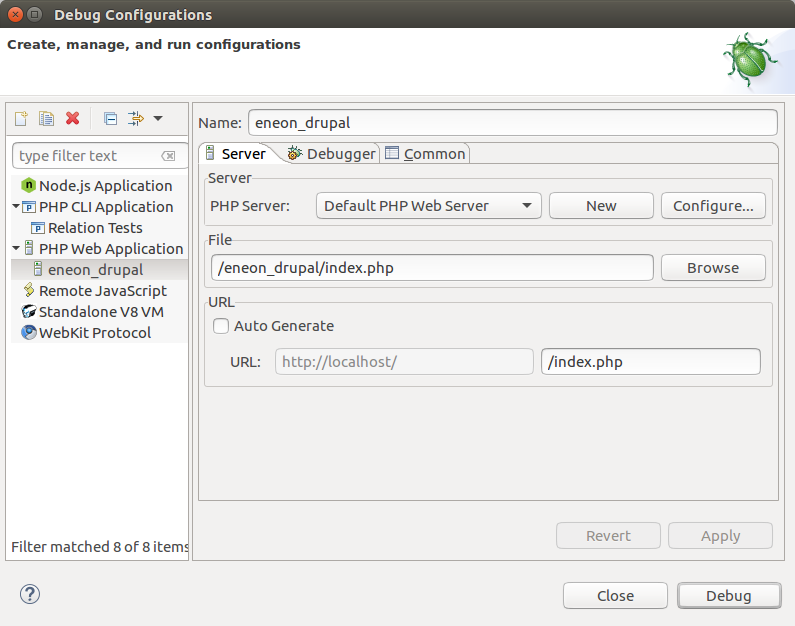
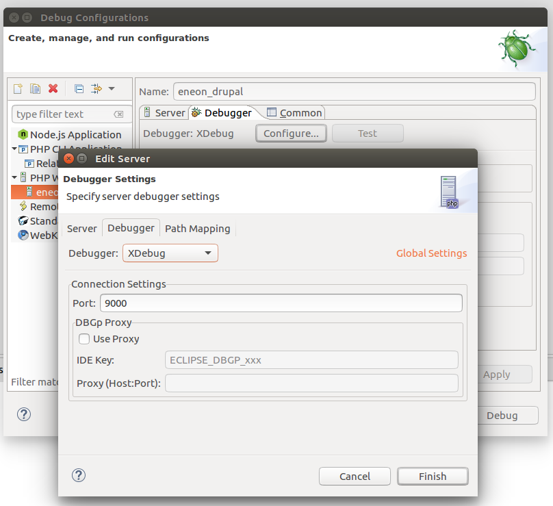
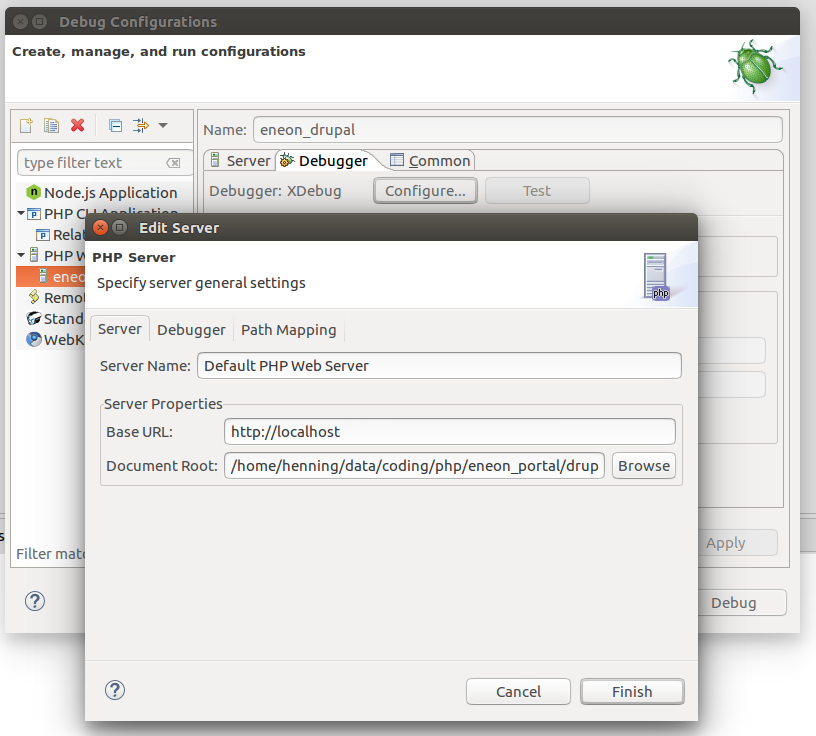
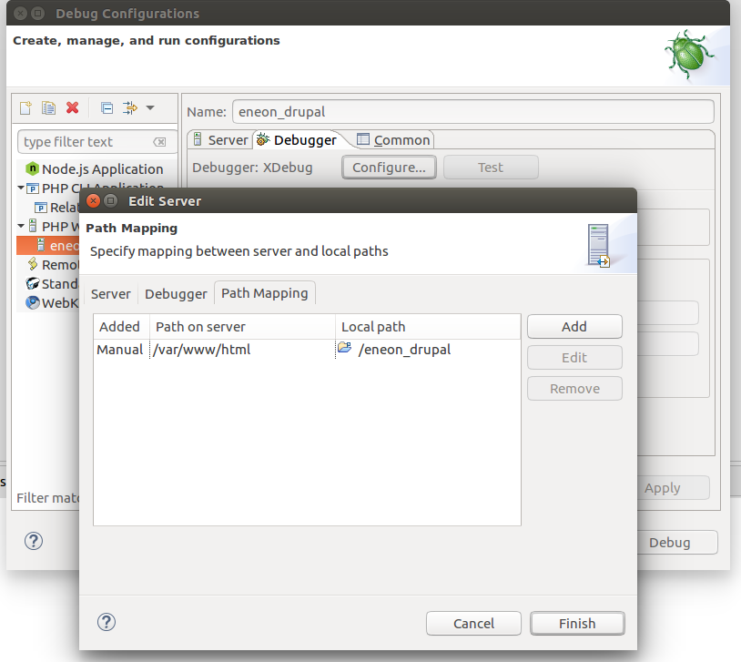

# ENEON commons Web Portal

ENEON commons aims to be a Web portal for facilitating discovery, access, re-use and creation of knowledge about observations, networks, and related activities (e.g. projects). The portal has been developed to cover the requirements for handling knowledge about in-situ earth observation networks. This prototype offers functionality for interactive discussion, information exchange and querying information about data delivered by different observation networks.

[ENEON](http://www.eneon.net/) is an activity initiated by [the European ConnectinGEO project](http://www.connectingeo.net/) to coordinate in-situ Earth observation networks with the aim to harmonise the access to observations, improve discoverability, and identify/close gaps in European earth observation data resources.

## Installation

### <tl;dr>
1. Create: `docker-compose up` and perform Drupal Installation
2. Restart: `docker-compose restart` and let Drupal configure portal

### More Details
Drupal has to be configured before first use. Start the portal via

  `docker-compose up`

Wait until the logs say you can now start Drupal's installation
process. Then open your Browser at http://localhost and follow
Drupal's install instruction. As database settings you have to
put in

- `database`: `eneon_db`
- `user`: `root`
- `password`: `mysql`
- `hostname`: `eneon_db` (under advanced)
- `port`: `3306` (under advanced)

Click `Next` and put in administration settings. Then click `Finish` and
restart the portal by either typing `ctrl+c` or `docker-compose stop` (in
case you started a detached docker-compose session (however, do not use
`docker-compose down` as this will clean the database and you'd have to
redo the installation step). You can watch Drupal installing required
modules via `docker-compose logs -f <container-name>`. When ready, update
your site http://localhost and everything should be setup.

## Configuration Settings
- setting the host whitelist for the external image cache: `admin/config/media/imagecache_external` (default is `www.eneon.net`)

## Development
### Debugging
Setup configures a ready-to-use [xDebug](https://xdebug.org/) environment. However, you'll need a local copy of Drupal project containing the source wherein to debug. Ideally place it under `drupal` dir under the root directory (it is in `.gitignore` by default).

Assuming you created a project from your local Drupal folder under the name `eneon_drupal`, then to debug,

* add a new debug configuration

* connect to the running Drupal container (Port 9000)

*  set the project root

* alter the web application mapping

